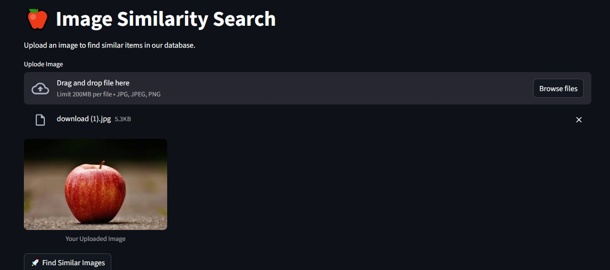
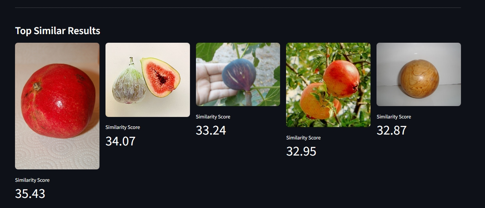

# 🖼️ Image Similarity Search using CNN (VGG16)

## 📌 Overview

**Image Similarity Search** is a computer vision project that finds **visually similar images or objects** based on a given **input image**.

The project uses **CNN feature extraction** with a **pretrained VGG16 model**, and similarity is computed using **cosine similarity** between deep feature vectors.

This approach is useful for:

* Image retrieval systems
* Object similarity detection
* Visual search engines
* Recommendation systems

---

## 🧠 Core Idea

1. Extract deep features from images using **VGG16**
2. Store feature vectors for all images
3. Extract features from the query image
4. Compute **cosine similarity**
5. Return the most similar images

---

## 🛠️ Tech Stack

* Python
* PyTorch
* Torchvision
* OpenCV
* NumPy
* Pretrained **VGG16 CNN**

---

## 📂 Project Structure

```
Image-Similarity-Search/
│── app.py
│── main.py
│── config.py
│── README.md
│── requirements.txt
│
├── datasets/          # Image dataset (not uploaded to GitHub)
├── weights/           # Pretrained model weights
├── stubs/             # Precomputed features (.pt file)
├── notebooks/         # Experiments & visualization notebooks
```

---

## 🚀 Run on Local PC

### 🔹 Step 1: Clone the Repository

```bash
git clone https://github.com/Ashis069/Image-Similarity-Search.git
cd Image-Similarity-Search
```

---

### 🔹 Step 2: Create Virtual Environment

```bash
python -m venv venv
source venv/bin/activate      # Linux / Mac
venv\Scripts\activate         # Windows
```

---

### 🔹 Step 3: Install Dependencies

```bash
pip install -r requirements.txt
```

---

### 🔹 Step 4: Create Required Folders

Manually create these folders in the root directory:

```bash
mkdir datasets weights stubs
```

---

## 📊 Dataset Setup

### 🔹 Download Dataset

Download the dataset from Kaggle:

**Dataset:**
👉 [ImageNet 1000 (Mini)](https://www.kaggle.com/datasets/ifigotin/imagenetmini-1000)

After downloading, extract and place it inside:

```
datasets/
```

---

## 🧩 Model Weights Setup

### 🔹 Download VGG16 Weights

Download pretrained VGG16 weights:

👉 [https://download.pytorch.org/models/vgg16-397923af.pth](https://download.pytorch.org/models/vgg16-397923af.pth)

Place the file inside:

```
weights/vgg16-397923af.pth
```

---

## ▶️ Run the Application

```bash
streamlit run app.py
```

---

## ⚠️ Low RAM / CPU Users (Recommended Solution)

If your PC:

* Has **low RAM**
* Has **no GPU**
* Is **slow for feature extraction**

👉 **Run the project on Kaggle instead**

---

## 🔹 Run on Kaggle (Recommended)

### Steps:

1. Upload the repository to Kaggle
2. Attach the ImageNet Mini dataset
3. Run the notebook using Kaggle GPU

---

### 📦 Precomputed Features (Fast Setup)

If you don’t want to compute features locally:

1. Download `data_and_features.pt` from this Kaggle notebook:
   👉 [https://www.kaggle.com/code/ashiskumarbera/image-similarity-search-using-vgg16-cosine](https://www.kaggle.com/code/ashiskumarbera/image-similarity-search-using-vgg16-cosine)

2. Place it inside:

```
stubs/data_and_features.pt
```

3. Run the app directly 🚀

---

## 📓 Notebook Inspiration

For better understanding of CNN internals and visualization:

👉 **Visualizing CNN Feature Maps with PyTorch**
[https://www.kaggle.com/code/ashiskumarbera/visualizing-cnn-feature-maps-with-pytorch](https://www.kaggle.com/code/ashiskumarbera/visualizing-cnn-feature-maps-with-pytorch)

---

## 🖼️ Results & Screenshots

See below for example outputs showing:

* Input image
* Retrieved similar images
* Feature-based similarity comparison




---


## 👤 Author

**Ashis Kumar Bera**
GitHub: [https://github.com/Ashis069](https://github.com/Ashis069)


